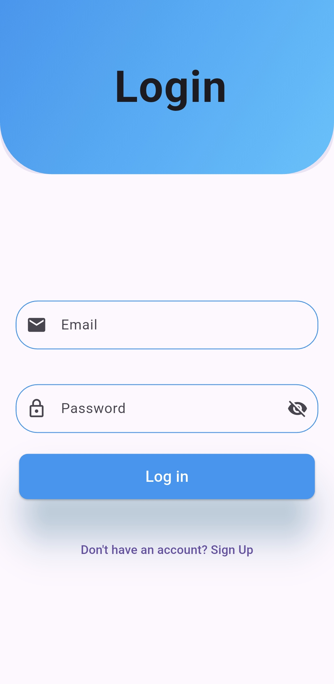
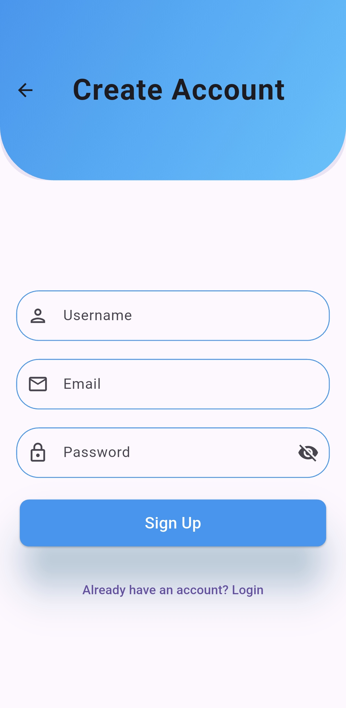
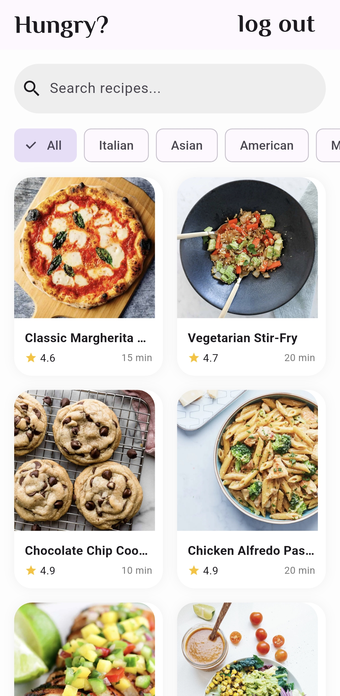
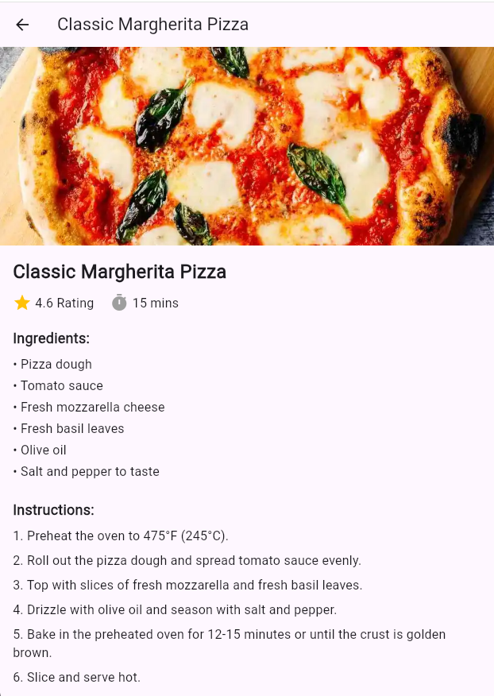

# 🍽️ Recipe App — Flutter + Firebase Authentication

A beautifully crafted Flutter mobile application that lets users discover, search, and explore delicious recipes. The app features a complete authentication flow (Login, Signup, Splash Screen) powered by **Firebase Authentication** and displays recipes fetched from a REST API with powerful search and filter capabilities.

---

## 📱 Project Overview

This is a full-stack **Flutter** mobile application with **Firebase** backend integration. When a user opens the app, they are greeted with an animated **Splash Screen** that checks their login status via `Shared Preferences`. Based on authentication state, the user is routed to either the **Login Page** or directly to the **Home Screen** (Recipe List).

The authentication system supports:
- **Email/Password Registration** with display name
- **Email/Password Login** with comprehensive error handling
- **Logout** functionality
- **Persistent Login State** (stays logged in across app restarts)

Once authenticated, users can browse recipes fetched from the [DummyJSON Recipes API](https://dummyjson.com/recipes), search by recipe name, filter by cuisine type, and view detailed recipe information including ingredients and step-by-step cooking instructions.

---

## ✨ Features

### 🔐 Authentication
- **Splash Screen** with fade-in animation and auto-login detection
- **User Registration** with name, email, and password
- **User Login** with email/password validation
- **Logout** with confirmation and session clearing
- Detailed, user-friendly error messages for all Firebase Auth exceptions (invalid email, wrong password, user not found, weak password, email already in use, etc.)

### 🍳 Recipe Browsing
- **Fetch recipes** from REST API (`https://dummyjson.com/recipes`)
- **Search recipes** by name in real-time
- **Filter recipes** by cuisine type using `ChoiceChip`
- **Responsive GridView** layout for recipe cards
- Each recipe card shows: image, name, ⭐ rating, and ⏱️ cooking time

### 📋 Recipe Details
- Full-screen recipe detail view
- Large hero image display
- Rating and cook time summary
- Complete **ingredients list**
- Numbered **step-by-step instructions**
- Clean, scrollable layout

### 🎨 UI/UX
- **Gradient AppBar** for a modern look
- **Custom reusable text field widget** with focused/enabled/error border states
- **Loading indicators** during API calls and authentication
- **Password visibility toggle** on login and signup
- **Google Fonts** integration for beautiful typography
- **Form validation** with regex-based email check and minimum password length

---

## 🛠️ Tech Stack

| Category | Technology |
|----------|------------|
| **Framework** | Flutter (Dart) |
| **Backend / Auth** | Firebase Authentication |
| **Local Storage** | Shared Preferences |
| **HTTP Client** | `http` package |
| **Fonts** | Google Fonts |
| **State Management** | StatefulWidget with `setState` |
| **API** | [DummyJSON Recipes](https://dummyjson.com/recipes) |
| **Platform Support** | Android, iOS, Web, Windows |

---

## 📂 Folder Structure

```
recipe_app/
│
├── lib/
│   ├── main.dart                    # App entry point & Firebase initialization
│   │
│   ├── screens/
│   │   ├── splash_screen.dart       # Animated splash with auto-login check
│   │   ├── login_page.dart          # Login screen with Firebase Auth
│   │   ├── signup_page.dart         # Registration screen
│   │   ├── home_screen.dart         # Recipe list with search & filter
│   │   └── details_screen.dart      # Recipe detail view
│   │
│   ├── services/
│   │   ├── login_service.dart       # Firebase login & logout logic
│   │   └── signup_service.dart      # Firebase user registration
│   │
│   ├── widgets/
│   │   └── custom_widget.dart       # Reusable custom text field
│   │
│   └── firebase_options.dart        # Firebase platform-specific config
│
├── assets/
│   └── images/                      # App images & assets
│
├── pubspec.yaml                     # Dependencies & configuration
└── README.md                        # Project documentation
```

---

## 🚀 Installation Steps

### Prerequisites
- Flutter SDK (≥3.0.0)
- Dart SDK
- Firebase account (free tier works)
- Android Studio / VS Code / Xcode

### Step 1: Clone the Repository

```bash
git clone <your-repo-url>
cd recipe_app
```

### Step 2: Install Dependencies

```bash
flutter pub get
```

### Step 3: Firebase Setup

1. Go to the [Firebase Console](https://console.firebase.google.com/)
2. Create a new project (or use existing)
3. Enable **Authentication** → **Email/Password** sign-in method
4. Register your app for Android, iOS, and/or Web
5. Download the configuration files:
   - `google-services.json` → place in `android/app/`
   - `GoogleService-Info.plist` → place in `ios/Runner/`
6. The `firebase_options.dart` file is already configured — update it with your project's values if needed

### Step 4: Run the App

```bash
# For Android
flutter run

# For iOS
flutter run

# For Web
flutter run -d chrome

# For Windows
flutter run -d windows
```

### Step 5: Build APK (Android)

```bash
flutter build apk --release
```

---

## 📸 Screenshots

| Screen | Description |
|--------|-------------|
| **Splash Screen** | Animated app title with fade-in effect; auto-redirects based on login state |
| **Login Screen** | Gradient AppBar, email & password fields, validation, loading state |
| **Signup Screen** | Name, email & password registration with Firebase |
| **Home Screen** | Recipe grid with search bar and cuisine filter chips |
| **Detail Screen** | Full recipe view with ingredients and instructions |

 ### Splash Screen

<p align="center">
  
</p>

### Login & Signup Screen

<p align="center">
  
   
</p>

### Home & Detail Screen

<p align="center">
  
  

</p>

 ---

## 🔧 Dependencies (pubspec.yaml)

```yaml
dependencies:
  flutter:
    sdk: flutter
  firebase_core: latest
  firebase_auth: latest  
  http: latest
  google_fonts: latest
```

 ---

## 👨‍💻 Author

<div align="center">

### **[BHUPENDER]**

 Flutter Developer | Building meaningful apps 🚀 

[](https://github.com/bhupender1208)

[](https://www.linkedin.com/in/bhupender-00b134282/)

[](mailto:bhupender00012@gmail.com)

</div>

---
 

<p align="center">
  Made with ❤️ using Flutter & Firebase
</p>

